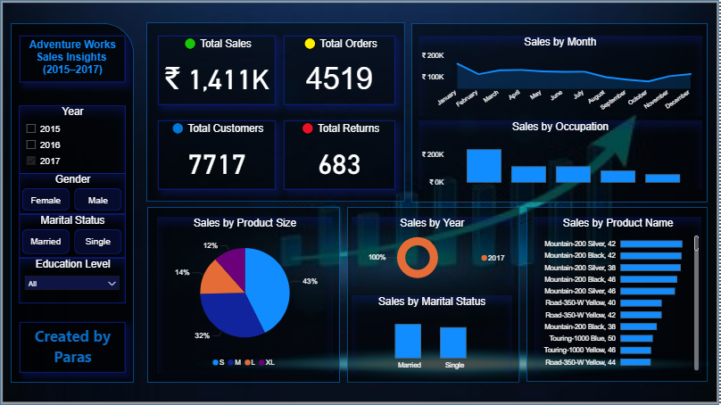

# Adventure Works – Power BI Dashboard (2015–2017)

This project presents a comprehensive Power BI dashboard analyzing sales and returns for Adventure Works from 2015 to 2017.

## 🔍 Key Insights
- Total Sales, Orders, Customers, and Returns
- Monthly and Yearly Sales Trends
- Sales by Product, Region, Occupation
- Return Analysis and Return Rate

## 📊 Tools Used
- Power BI (Dashboarding & DAX)
- Excel (Data Cleaning)
- GitHub (Version Control)

## 📸 Dashboard Preview

## 📁 Files Included
- `AdventureWorks_Dashboard.pbix` – Power BI Dashboard file
- `Dashboard.PNG` – Screenshot of the final dashboard

---

Created by **Paras** | [Your LinkedIn or Portfolio link here]
